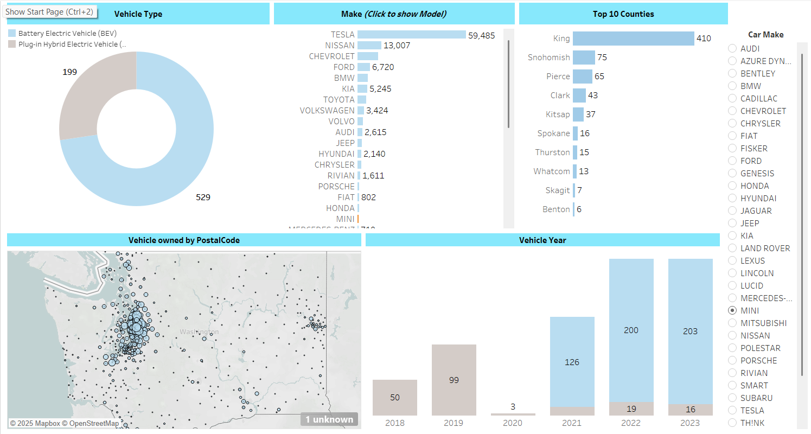

# ⚡ Electric Vehicle (EV) Analysis – Washington State

An interactive Tableau dashboard that explores Electric Vehicle (EV) adoption trends across Washington State using real-world vehicle registration data.

🔗 **Live Dashboard**: [View on Tableau Public](https://public.tableau.com/app/profile/subramaniyam.sa/viz/EVAnalysisWashinton_17482511107080/Dashboard1?publish=yes)

---

## 📊 Dashboard Features

- 📌 **Vehicle Type Distribution**: Comparison of Battery Electric Vehicles (BEVs) vs. Plug-in Hybrid Electric Vehicles (PHEVs).
- 🚗 **Top Car Makes**: Interactive bar chart showing top manufacturers, led by Tesla.
- 🏙️ **Top 10 Counties**: Visual ranking of counties by EV ownership.
- 🗺️ **Geospatial Distribution**: Map showing EV ownership density by ZIP code.
- 📅 **Vehicle Year Analysis**: Trends in vehicle registrations from 2018 to 2023.
- 🎛️ **Interactive Controls**: 
  - **Parameters** to select specific car makes and dynamically update charts.
  - **Sets** to highlight top performers.
  - **Calculated Fields** to derive insights such as BEV vs. PHEV counts and filter custom segments.

---

## 📁 Files Included

- `Tableau Sales Dataset.xlsx`: Raw dataset used for analysis.
- `Screenshot.png`: Dashboard preview.

---

## 💡 Key Insights

1. **Tesla** accounts for over 59,000 EVs, dominating the market.
2. **King County** is the top adopter of electric vehicles.
3. Majority of registered EVs are **Battery Electric Vehicles (BEVs)**.
4. Rapid adoption observed post-2021, with peaks in **2022 and 2023**.

---

## 🛠 Tools & Techniques Used

- **Tableau Public** for interactive data visualization
- **Microsoft Excel** for initial data preparation
- **Advanced Tableau Features**:
  - Parameters for dynamic control and filtering
  - Sets for focused analysis of top performers
  - Calculated Fields for custom logic and derived metrics
